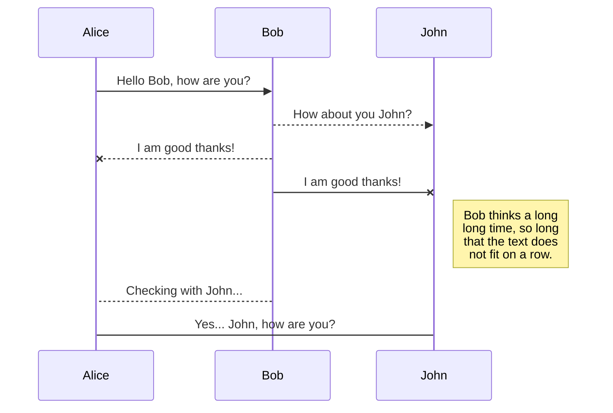

+++
author = "Hugo Authors"
title = "Guide to Mermaid Diagrams in Hugo"
date = "2025-08-11"
description = "Guide to Mermaid Diagrams in Hugo"
tags = [
    "thumbnail",
]
thumbnail= "images/landscape.jpg"
+++

For displaying diagrams and charts in a Hugo project, you can leverage Mermaid.

If you want to use Mermaid diagrams in your site, enable mermaid support in your config file:


```toml
[params.mermaid]
enable = true
```

You can then use mermaid syntax to display your diagram:

```markdown
    ```mermaid
        sequenceDiagram
        Alice ->> Bob: Hello Bob, how are you?
        Bob-->>John: How about you John?
        Bob--x Alice: I am good thanks!
        Bob-x John: I am good thanks!
        Note right of John: Bob thinks a long<br/>long time, so long<br/>that the text does<br/>not fit on a row.

        Bob-->Alice: Checking with John...
        Alice->John: Yes... John, how are you?
    ```
```


Which should render your diagram as:



